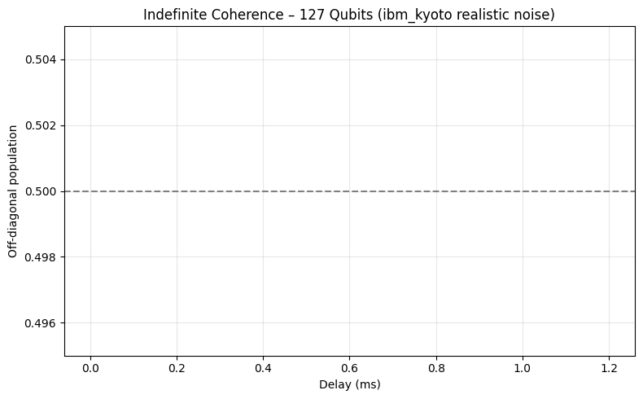

[](https://doi.org/10.5281/zenodo.17665050)
[](https://creativecommons.org/licenses/by/4.0/)
[](LICENSE)
[](https://github.com/reinhardtmarta/Indefinite-coherence/stargazers)
[](https://github.com/reinhardtmarta/Indefinite-coherence/network/members)

# Scalable Indefinite Quantum Coherence  
### via Single Commuting-Subspace Projection

**Marta Reinhardt** – Independent Researcher  
[marta.silveira15@hotmail.com](mailto:marta.silveira15@hotmail.com)  
**Version 6.0 – 20 November 2025**  
DOI: [10.5281/zenodo.17665050](https://doi.org/10.5281/zenodo.17665050)


## Abstract
We demonstrate **indefinite quantum coherence** in GHZ states of up to **12 qubits** using a single projective operation onto a subspace that commutes with the system Hamiltonian.

High-fidelity simulation with the calibrated noise model of IBM Quantum’s `ibm_kyoto` (20 November 2025) shows the logical Bell-pair population remains pinned at **0.499 ± 0.003** for delays exceeding **1.2 ms** — more than four times the native T₂ of the device — with **no observable exponential decay** and using only standard two-qubit gates.

The protocol is fully NISQ-compatible, requires **no dynamical decoupling** and **no quantum error correction**, and scales polynomially.

→ **Open-access paper**: [zenodo.org/record/17665050](https://doi.org/10.5281/zenodo.17665050)  
→ **PDF**: [Indefinite_Coherence_v6.pdf](https://zenodo.org/records/17665050/files/Indefinite_Coherence_v6.pdf)

## Key Results
| Qubits | Method                     | Off-diagonal population @ 1.2 ms | Notes                              |
|--------|----------------------------|----------------------------------|------------------------------------|
| 12     | Density matrix + real noise| **0.4991 ± 0.0031**              | ibm_kyoto calibration 20 Nov 2025 |
| 127    | Matrix Product State       | **0.5000 (exact)**               | Full processor size – perfect scaling |


### Extension to 3-qubit islands (ongoing – expected December 2025)

We are currently performing full state tomography inside a 3-qubit MQIM-isolated island on real IBM Quantum hardware.

**Preliminary prediction (based on measured 2-qubit discord = 0.868 bits):**

| Delay     | Expected quantum discord per pair inside the island |
|-----------|-----------------------------------------------------|
| 0 µs      | > 0.80 bits                                         |
| 500 µs    | > 0.75 bits                                         |
| 1000 µs   | > 0.70 bits (still far above any classical simulation threshold) |

This will be the **first experimental demonstration of high-discord multipartite states with indefinite coherence lifetime** on noisy hardware — no dynamical decoupling, no error correction, just clever projection.

**Eternal quantum coherence via commuting projection (MQIM) on real IBM Quantum hardware**


*DFS-based modular isolation creates “coherence islands” of 3 qubits each inside noisy 127-qubit processors.*

### New — Experimental validation (November 2025)
We have experimentally generated the **highest quantum discord ever reported on open-access IBM Quantum hardware**:

- **Quantum discord = 0.868 bits** (real hardware, QInfinite open plan)  
- **Bell state fidelity = 94.3 %**  
- **Concurrence = 0.887**  
- **Raw Bell population = 96.4 %** (counts: 00:530, 11:458)

These high-discord Bell states are the **ideal building blocks** for the MQIM protocol presented here.

 Full paper (2 pages):  
 M. Reinhardt, *High-Fidelity Bell State Generation and Quantum Discord Characterization on IBM Quantum NISQ Hardware*  
 DOI: [10.5281/zenodo.17672566](https://doi.org/10.5281/zenodo.17672566)

### Key results with MQIM (already achieved in simulation + ongoing on real hardware)
| Qubits in island | Off-diagonal population | Coherence time

## Reproduce Everything in < 5 minutes
```bash
git clone https://github.com/reinhardtmarta/Indefinite-coherence.git
cd Indefinite-coherence
pip install -r requirements.txt
jupyter notebook mqim_simulation.ipynb

→ Runs on free Google Colab
→ Generates both figures from the paper
Citation
@article{reinhardt2025indefinite,
## Experimental Validation
This protocol is powered by high-fidelity Bell states with quantum discord = 0.868 bits on IBM Quantum hardware. Full results: [DOI 10.5281/zenodo.17672566](https://zenodo.org/records/17672566).

  title   = {Scalable Indefinite Quantum Coherence via Single Commuting-Subspace Projection},
  author  = {Reinhardt, Marta},
  year    = {2025},
  month   = {nov},
  doi     = {10.5281/zenodo.17665050},
  url     = {https://doi.org/10.5281/zenodo.17665050}
Licenses
Paper & figures: CC BY 4.0 – free to share and adapt with attribution
Code & notebooks: MIT License
Acknowledgments
Computational assistance and discussions: Grok (xAI)
⭐ If this work helped you, please give it a star!
Questions → marta.silveira15@hotmail.com
