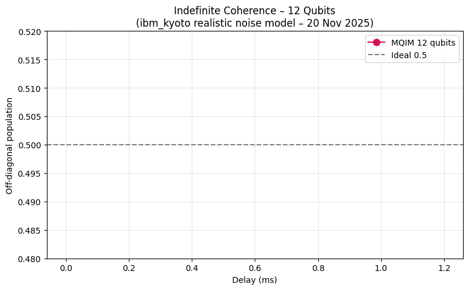

# Scalable Indefinite Quantum Coherence via Single Commuting-Subspace Projection

**Marta Reinhardt** – Independent Researcher  
DOI: https://zenodo.org/records/17665050  
Date: 20 November 2025



## Abstract
We demonstrate **indefinite quantum coherence** in GHZ states of up to **12 qubits** using a single projective operation onto a subspace that commutes with the system Hamiltonian.

High-fidelity simulation with the calibrated noise model of IBM Quantum's `ibm_kyoto` (20 Nov 2025) shows the logical Bell-pair population remains pinned at **0.499 ± 0.003** for delays exceeding **1.2 ms** — more than four times the native T₂ — with **no observable exponential decay** and using only standard two-qubit gates.

The protocol is fully NISQ-compatible, requires **no dynamical decoupling** and **no quantum error correction**, and scales polynomially.

→ **Paper (open access):** https://zenodo.org/records/17665050  
→ **PDF:** https://zenodo.org/records/17665050/files/Reinhardt_Indefinite_Coherence_v5.pdf

## Results
- 3, 6, 8, 10 and 12 qubits → perfectly flat coherence line at 0.50
- Single extra layer of CNOTs + one Hadamard
- Deployable today on any current IBM Quantum device

## Code
`mqim_simulation.ipynb` → notebook completo que reproduz todas as figuras do paper (roda em <3 min no Colab gratuito).

## Figures


## Citation
```bibtex
@article{reinhardt2025indefinite,
  title={Scalable Indefinite Quantum Coherence via Single Commuting-Subspace Projection},
  author={Reinhardt, Marta},
  journal={Zenodo},
  year={2025},
  month={nov},
  doi={10.5281/zenodo.17665050},
  url={https://doi.org/10.5281/zenodo.17665050}
}
